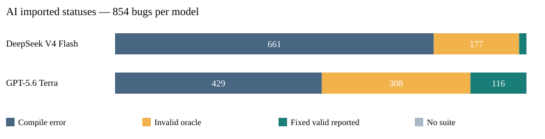
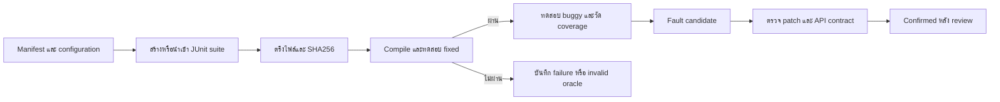

# SQA Project 2026

## MOSA · GRT · DeepSeek V4 Flash · GPT-5.6 Terra

โครงการเปรียบเทียบการสร้างกรณีทดสอบ Java อัตโนมัติบน **Defects4J จำนวน 854 บั๊ก จาก 17 โปรเจกต์**
สำหรับรายวิชา **CP353201 Software Quality Assurance ภาคเรียน 1 ปีการศึกษา 2569 มหาวิทยาลัยขอนแก่น**
พิจารณาความสำเร็จในการประเมิน Line/Branch Coverage การตรวจพบข้อบกพร่อง และต้นทุนการสร้างเทสต์

README นี้นำเนื้อหาจาก [รายงานคนที่ 4](document/MEMBER4_REPORT.html) มาเป็นเอกสารหลัก
พร้อมวิธีติดตั้ง รันซ้ำ โครงสร้างไฟล์ และรายงานฉบับเต็มด้านล่าง
ขอบเขตงานคนที่ 3 เปลี่ยนจาก Claude/Codex เป็น **Deepseek-v4_flash และ gpt-5.6-terra** แล้ว

> **สถานะข้อมูล 5 ตุลาคม 2026:** รวมผลจากไฟล์ที่มีอยู่จริงแล้ว ตัวเลข fault detection ของ AI เป็น
> **reported candidates** ยังไม่ใช่ confirmed FDR ส่วน Docker smoke บนเครื่องปัจจุบันยังไม่ได้รันซ้ำ
> อ่านผลพร้อมตัวหารและระดับหลักฐาน ไม่ใช้จำนวนแถว CSV แทนจำนวนเทสต์ที่ผ่าน

### สารบัญ

- [ภาพรวมและผลสำคัญ](#overview)
- [วิธีอ่านผลและเงื่อนไขเปรียบเทียบ](#method)
- [โครงสร้างโปรเจกต์](#structure)
- [ติดตั้งโปรเจกต์](#installation)
- [รันซ้ำการรวมผลและสร้างรายงาน](#reproduce)
- [รันทดลอง MOSA และ GRT](#algorithms)
- [การใช้งาน DeepSeek และ GPT](#ai)
- [ทดสอบระบบและแก้ปัญหา](#validation)
- [สมาชิกและหน้าที่](#team)
- [รายงานฉบับเต็ม 5 บท](#full-report)
- [เอกสารและข้อมูลส่งมอบ](#artifacts)

<a id="overview"></a>
## ภาพรวมและผลสำคัญ

| เทคนิค | วิธีสร้างชุดทดสอบ | โฟลเดอร์หลัก |
|---|---|---|
| MOSA ผ่าน EvoSuite | Many-objective search ตาม configuration ของทีม | [MOSA_EvoSuite](MOSA_EvoSuite) |
| GRT | Guided random testing ที่ทีมพัฒนาตามแนวทางงานวิจัย | [GRT](GRT) |
| DeepSeek V4 Flash | ชุดทดสอบ AI ที่นำเข้าและแผน Direct API | [Deepseek-v4_flash](Deepseek-v4_flash) |
| GPT-5.6 Terra | ชุดทดสอบ AI ที่นำเข้าและแผน Direct API | [gpt-5.6-terra](gpt-5.6-terra) |

ตรวจพบ **native result.json 2,562 รายการ** และ **AI CSV นำเข้า 1,708 แถว**
ชุดหลัก MOSA/GRT ใช้ Round1, seed 101, budget 30 วินาทีต่อ target และมีสถานะครอบคลุม 854 บั๊กทั้งคู่
ผลมีหลาย implementation และหลาย attempt จึงรายงานแยกกลุ่ม ไม่รวม retries เป็นการทดลองอิสระ

### ผล AI จากตารางนำเข้า

| รายการ | DeepSeek V4 Flash | GPT-5.6 Terra |
|---|---:|---:|
| บั๊กที่วางแผน / มีสถานะใน CSV | 854 / 854 | 854 / 854 |
| ไม่มี suite | 1 | 1 |
| Compile ไม่ผ่าน | 661 | 429 |
| Fixed ไม่ผ่าน / invalid oracle | 177 | 308 |
| Fixed ผ่านตามตาราง | 15 | 116 |
| Reported fault candidates | 11 | 107 |
| Candidates / planned 854 บั๊ก | 1.29% | 12.53% |
| Line / Branch เฉลี่ย ทุกชุดที่วัดได้ | 80.87% / 73.45% (n=192) | 88.34% / 82.55% (n=424) |
| Line / Branch เฉลี่ย เฉพาะ fixed valid | 88.74% / 85.67% (n=15) | 97.43% / 93.50% (n=116) |



**ข้อจำกัดของตาราง:** Run-id ของ CSV ไม่ตรงกับ run logs ที่มี จึงยังไม่ใช้ logs เหล่านั้นรับรองการรันเดียวกัน
ชื่อโมเดลและ token ของชุดนำเข้ายังไม่มี original API evidence เพียงพอให้ยืนยัน
ทั้ง 11 และ 107 รายการต้องตรวจความสัมพันธ์กับบั๊กก่อนเรียกว่า confirmed detection
รายละเอียดรายบั๊กอยู่ใน [ai_imported_units.csv](results/member4/ai_imported_units.csv)

### ผล MOSA และ GRT ชุดหลัก แยก implementation

ตารางนี้ใช้ attempt แรกต่อ unit ที่เลือกย้อนหลัง และ seed 101 / 30 วินาทีต่อ target
จำนวน EVALUATED เป็น **target units** ส่วน candidates เป็น **unique bugs ภายในแต่ละแถว**

| เทคนิค | Implementation 12 ตัวแรก | บั๊กที่มีผล | Target units | EVALUATED | Candidate bugs | Line % | Branch % |
|---|---|---:|---:|---:|---:|---:|---:|
| MOSA | 23ed78b73f64 | 559 | 714 | 515 | 122 | 64.11 | 58.29 |
| MOSA | 3daf9d8187ea | 263 | 326 | 240 | 79 | 73.87 | 70.59 |
| MOSA | 8e4d591b349e | 32 | 33 | 24 | 4 | 46.04 | 34.63 |
| GRT | 2095c4d4de9e | 790 | 996 | 791 | 81 | 44.11 | 29.73 |
| GRT | 23ed78b73f64 | 64 | 77 | 61 | 4 | 50.15 | 33.45 |
| GRT | 3daf9d8187ea | 1 | 1 | 0 | 0 | N/A | N/A |

ห้ามบวกจำนวนบั๊กข้าม implementation เพราะอาจมีบั๊กซ้ำกัน และแต่ละแถวมีขอบเขตต่างกัน
Line/Branch เฉลี่ยเฉพาะ EVALUATED ที่ผ่าน integrity checks; n ของแต่ละ metric อยู่ใน
[native_cohorts.csv](results/member4/native_cohorts.csv) ผล 60/180 วินาทีแยกไว้ในไฟล์เดียวกัน
ยังไม่สรุปว่าเทคนิคใดชนะจากตารางที่ใช้หน่วยและชุดบั๊กต่างกัน

<a id="method"></a>
## วิธีอ่านผลและเงื่อนไขเปรียบเทียบ



- **Native results** มี per-run JSON และหลักฐาน evaluator; **imported claims** เป็นข้อมูลที่นำเข้าจาก CSV แยกชุดกัน
- **Validation/smoke** ใช้ตรวจระบบ ไม่รวมในผล benchmark หลัก
- **Attempt** คือการรันซ้ำของ unit เดิม ไม่ใช่ independent repetition และไม่เลือกเฉพาะ attempt ที่สำเร็จ
- **Missing coverage** เป็น N/A; ค่า 0 ที่วัดได้จริงยังเป็น 0 และรวมในค่าเฉลี่ย
- **Candidate** คือ differential failure ที่ต้องตรวจต่อ; **confirmed bug** ต้องมีหลักฐาน review ที่สัมพันธ์กับ suite hash
- Native coverage เฉลี่ยต่อ target; AI coverage เฉลี่ยต่อ suite ต่อบั๊ก ต้องควบคุมขอบเขตก่อนเปรียบเทียบโดยตรง
- GRT เป็น implementation ของทีม ไม่ใช่ binary ของผู้เขียนงานวิจัย ดู [ข้อแตกต่าง](GRT/README.md)

<a id="structure"></a>
## โครงสร้างโปรเจกต์

```text
ProjectSQA/
├── README.md                         # เอกสารหลักและวิธีทำซ้ำ
├── requirements/                     # คู่มือแบ่งหน้าที่สมาชิก 1–4
├── config/
│   ├── benchmark.json                # protocol และค่า runner เดิม
│   ├── round1-full854.json           # ชุดหลัก 854 bugs / 30s / seed 101
│   ├── dependencies.lock.json        # versions, URLs และ SHA256 dependencies
│   ├── ai-api.json                   # KKU endpoint และโมเดลที่ร้องขอ
│   └── ai-control.json               # สถานะ pause ของ API
├── docker/                           # Dockerfile และ Docker Compose
├── scripts/                          # generate, evaluate, audit และ collect
├── tests/                            # Python tests และ Java fixtures
├── dataset/defects4j/                 # metadata ต้นทางที่มีอยู่ใน checkout
├── prompts/                          # templates สำหรับ API generation
├── MOSA_EvoSuite/
│   ├── Code/                         # wrapper/คำอธิบาย MOSA
│   ├── Configuration/                # frozen configuration ราย run
│   ├── Campaigns/                    # manifest และ progress
│   ├── Test/                         # generated Java และ scaffolding
│   ├── Result_Round1/                # หลักฐานการประเมินราย run
│   └── Result_Round2/                # ผลรอบเก่า แยกจากชุดหลัก
├── GRT/
│   ├── Code/                         # implementation GRT ของทีม
│   ├── Configuration/
│   ├── Campaigns/
│   ├── Test/
│   ├── Result_Round1/
│   ├── Result_Round2/
│   └── Review/                       # AI review เดิม ไม่ใช่ human confirmation
├── Deepseek-v4_flash/
│   ├── Prompt/<Project>/<Project>_<bug>b/
│   ├── TestCode/<Project>/<Project>_<bug>b/
│   └── Result/<Project>/<Project>_<bug>b/
├── gpt-5.6-terra/                     # โครงสร้าง Prompt/TestCode/Result เหมือน DeepSeek
├── AI_API/
│   ├── setup.ps1, run.ps1             # host entry points
│   ├── Campaign/                     # แผน API generation ที่ freeze ไว้
│   ├── ExistingSuites/               # แผนประเมินชุดนำเข้าและ implementation.zip
│   └── ImportedResults/              # ผลตรวจความตรงกันของ AI evidence
├── results/
│   ├── benchmark.csv                 # ตาราง AI นำเข้าต้นฉบับ
│   ├── ai_existing_summary.csv        # summary นำเข้า ต้องรักษาที่มา
│   ├── <Project>/<bug>/               # JSON รายบั๊กที่มีอยู่
│   ├── run_logs/                     # logs ของการรันที่ส่งมา
│   └── member4/                      # CSV/JSON/กราฟที่สร้างจากการรวมผล
│       ├── metadata/                 # snapshot ครบ 17 projects จาก manifest
│       ├── native_runs.csv
│       ├── native_cohorts.csv
│       ├── ai_summary.csv
│       ├── fault_review_queue.csv
│       └── source_manifest.json
├── document/
│   ├── MEMBER4_REPORT.md             # รายงาน 5 บท ฉบับแก้ไขข้อความ
│   ├── MEMBER4_REPORT.html           # รายงานสำหรับอ่านและพิมพ์
│   └── MEMBER4_DEMO.md               # เส้นทางเปิดหลักฐานตัวอย่าง
├── .env.example                      # ตัวอย่างชื่อ environment variable ไม่มี key จริง
└── work/                             # สร้างเมื่อรัน เก็บ checkout/temp ไม่ส่งเข้า Git
```

ผลอัลกอริทึมอยู่ใน `<Project>/<Bug>/<run-id>/` ส่วน native AI อาจมี `<run-id>/` ใต้ bug folder
ไฟล์ result.json บางรายการเก็บพาธก่อนย้ายชั้น project ตัวตรวจคนที่ 4 อ่านได้โดยไม่แก้หลักฐานเดิม

<a id="installation"></a>
## ติดตั้งโปรเจกต์

### สิ่งที่ต้องมี

| การใช้งาน | สิ่งที่ต้องติดตั้ง |
|---|---|
| อ่านรายงานและดูผลที่ส่งไว้ | Git และเบราว์เซอร์/โปรแกรมอ่าน Markdown |
| รวมผล สร้าง HTML และรัน Python tests | Python 3.10 ขึ้นไป; สคริปต์ส่วนนี้ใช้ standard library ไม่ต้อง pip install |
| สร้าง/ประเมิน Java กับ Defects4J | Docker พร้อม Compose และ Linux containers |
| สร้างเทสต์ AI ใหม่ | Python บน host, Docker และ KKU_API_KEY ที่มีสิทธิ์ใช้โมเดลตาม config |

บน Windows เปิด Docker Desktop และใช้ Linux containers ให้ `docker info` ทำงานได้
บน Linux/macOS ใช้ Docker ที่รองรับ Compose
งาน Java ใช้ dependencies ภายใน image จึงไม่ต้องติดตั้ง Java/EvoSuite/Defects4J เพิ่มบน host
AI runner ตรวจพื้นที่ว่างอย่างน้อย 8 GiB ก่อนเริ่มงาน และต้องมีพื้นที่เพิ่มสำหรับ image/checkouts

### 1. Clone repository ทั้งชุด

```bash
git clone https://github.com/ChillChill007x/ProjectSQA.git
cd ProjectSQA
```

อย่าคัดลอกเฉพาะโฟลเดอร์เครื่องมือ เพราะ runner ใช้ scripts/config และ Java support ร่วมกัน
คำสั่งต่อไปให้เริ่มจาก root ของ ProjectSQA

### 2. ตรวจเครื่องมือบน host

```powershell
git --version
python --version
docker --version
docker compose version
docker info
```

Linux/macOS ใช้ `python3` แทน `python` ถ้าเครื่องกำหนดชื่อ executable แบบนั้น
หากต้องการเพียงรวมผลเดิม สามารถข้ามขั้นตอน Docker แล้วไป [รันซ้ำการรวมผล](#reproduce) ได้

### 3. Build image และเข้าระบบทดลอง

Windows PowerShell:

```powershell
powershell -ExecutionPolicy Bypass -File scripts/start.ps1
```

Linux/macOS:

```bash
bash scripts/start.sh
```

สคริปต์จะ build `sqa-runner`, รัน `scripts/doctor.py` แล้วเปิด bash ที่ `/workspace`
เมื่อ doctor ไม่ผ่าน สคริปต์จะหยุด ให้แก้สาเหตุก่อนเริ่มทดลอง
คำสั่ง Python ของ MOSA/GRT ในหัวข้อถัดไปให้รัน **ภายใน container**

image ใช้ Java 11 สำหรับ Defects4J/GRT และ Java 8 สำหรับ EvoSuite
Defects4J ถูกตรึงที่ commit `6d54320e0db5a357f9ab38a8e4d2e5aead7e1c09`
ส่วน dependencies อื่นตรวจ SHA256 ตาม [lock file](config/dependencies.lock.json)
timezone ของการทดลองภายใน container คือ `America/Los_Angeles` ตาม protocol

<a id="reproduce"></a>
## รันซ้ำการรวมผลและสร้างรายงาน

**เส้นทางนี้ทำได้จากหลักฐานเดิม ไม่ใช้ Docker ไม่เรียก API และไม่สร้างเทสต์ใหม่**
รันบน host ที่ root ของ repository:

```powershell
python -B scripts/consolidate_member4.py
python -B AI_API/audit_results.py
python -B scripts/build_member4_report.py
```

| คำสั่ง | ผลลัพธ์ |
|---|---|
| consolidate_member4.py | ตรวจ native evidence และสร้าง results/member4/*.csv / *.json |
| AI_API/audit_results.py | ตรวจ AI imported evidence แล้วอัปเดต AI_API/ImportedResults |
| build_member4_report.py | สร้างรายงาน Markdown/HTML, demo, กราฟ และ metadata snapshot |

เปิด [document/MEMBER4_REPORT.html](document/MEMBER4_REPORT.html) ด้วยเบราว์เซอร์
แล้วใช้ปุ่ม **พิมพ์รายงาน / Save as PDF** ได้ ส่วนผลละเอียดดู [คำอธิบายตาราง](results/member4/README.md)
GitHub แสดง source ของ HTML; หากต้องการอ่านทันทีบน GitHub ใช้ [ฉบับ Markdown](document/MEMBER4_REPORT.md)

หากต้องการ raw native CSV ทุก attempt แยกต่างหาก:

```powershell
python -B scripts/collect_results.py
```

ผลอยู่ใน `results/summary.csv` ซึ่งยังไม่ได้คัด attempt จึงไม่ใช้แทน native_cohorts.csv
คำสั่งสร้างรายงานไม่เขียน README นี้ใหม่ ตัวเลขใน README เป็น snapshot วันที่ระบุด้านบน

<a id="algorithms"></a>
## รันทดลอง MOSA และ GRT

ชุดหลักใช้ [config/round1-full854.json](config/round1-full854.json): 854 bugs, Round1, seed 101, 30 วินาทีต่อ target
ไม่ใช้ค่า 60/180 วินาทีของ runner เดิมมาปะปนกับชุดนี้

### MOSA ผ่าน EvoSuite

รันใน container ตามลำดับ ตรวจ prepare และ smoke ให้ผ่านก่อนเริ่มชุดเต็ม:

```bash
python3 scripts/run_full_round1.py --tool evosuite --prepare
python3 scripts/run_full_round1.py --tool evosuite --smoke
python3 scripts/run_full_round1.py --tool evosuite --resume
python3 scripts/run_full_round1.py --tool evosuite --status
```

### GRT

```bash
python3 scripts/run_full_round1.py --tool grt --prepare
python3 scripts/run_full_round1.py --tool grt --smoke
python3 scripts/run_full_round1.py --tool grt --resume
python3 scripts/run_full_round1.py --tool grt --status
```

`--smoke` ใช้ Lang-1 และแยกเป็น validation; ไม่รวมในผลหลัก
`--resume` ดำเนินงานที่ยังไม่เสร็จ โดยคง terminal failures ไว้
ถ้าต้องการตรวจเฉพาะโปรเจกต์หนึ่ง ใช้ `--project` กับ prepare/resume/status ให้ตรงกัน:

```bash
python3 scripts/run_full_round1.py --tool grt --project Lang --prepare
python3 scripts/run_full_round1.py --tool grt --project Lang --resume
python3 scripts/run_full_round1.py --tool grt --project Lang --status
```

หลังตรวจสาเหตุ failure แล้ว ใช้ `--retry-failed` เพื่อสร้าง attempt ใหม่โดยเก็บหลักฐานเก่า:

```bash
python3 scripts/run_full_round1.py --tool grt --project Lang --retry-failed
```

Campaign แยกด้วย profile และ implementation fingerprint
เมื่อแก้ scripts/config จะเป็นเงื่อนไขใหม่ ไม่ถือว่าเป็นการ resume ผลเก่าด้วยโค้ดเดียวกัน
`--status` ต้องมี manifest ของ fingerprint ปัจจุบันก่อน และ exit code 1 อาจหมายถึงยังไม่สำเร็จครบทุกบั๊ก
ดูผลเก่าทุก campaign ได้จากตัวรวม offline โดยไม่ต้องรัน generation

### สกัด metadata จาก Defects4J

รันภายใน container หลัง doctor ผ่าน:

```bash
python3 scripts/extract_metadata.py
```

คำสั่งนี้สร้าง `<Project>_metadata_v2.json` ใน `dataset/defects4j/` จาก Defects4J ที่ติดตั้งจริง
ส่วน `results/member4/metadata/` เป็น snapshot จาก manifest ที่มีอยู่ จึงยังไม่มี revision/trigger fields ครบ
สองชุดนี้มีที่มาต่างกันและไม่ใช้แทนกันโดยอัตโนมัติ

<a id="ai"></a>
## การใช้งาน DeepSeek และ GPT

| Provider ในคำสั่ง | Model ID ที่ร้องขอ | โฟลเดอร์ |
|---|---|---|
| deepseek | deepseek-v4-flash | Deepseek-v4_flash |
| openai | gpt-5.6-terra | gpt-5.6-terra |

ใช้ KKU Direct API ตาม [config/ai-api.json](config/ai-api.json)
คำว่า `openai` เป็นชื่อ provider ใน runner ไม่ใช่การยืนยันว่าใช้ endpoint ของ OpenAI โดยตรง
ไม่ต้องใช้ image `sqa-ai` หรือ login Claude/Codex CLI สำหรับ workflow ปัจจุบัน

### ตรวจชุดข้อมูลที่ส่งมาแล้ว

คำสั่งเหล่านี้ไม่เรียก API:

```powershell
python -B scripts/check_submission.py --tool deepseek
python -B scripts/check_submission.py --tool openai
python -B AI_API/audit_results.py
```

`check_submission.py` ตรวจ native result.json ที่มีจริง ขณะตรวจมีโมเดลละ 1 run สำหรับ Lang-1
การผ่านคำสั่งนี้ไม่ได้รับรอง AI CSV ทั้ง 1,708 แถว
ใช้ [ImportedResults](AI_API/ImportedResults/README.md) สำหรับข้อขัดแย้งของ CSV/run-id/hash

### เตรียมเครื่องสำหรับประเมินหรือสร้าง AI ใหม่

รันบน **Windows host PowerShell** หลัง Docker พร้อม:

```powershell
.\AI_API\setup.ps1
.\AI_API\run.ps1 -Action doctor -Workflow existing
```

การประเมินชุดเดิมแบบ `existing` ไม่ต้องมี API key
หากจะสร้างใหม่ ให้คัดลอก `.env.example` เป็น `.env` เมื่อยังไม่มีไฟล์ แล้วเติม `KKU_API_KEY` บนเครื่อง:

```powershell
if (!(Test-Path -LiteralPath .env)) {
    Copy-Item -LiteralPath .env.example -Destination .env
}
notepad .env
.\AI_API\run.ps1 -Action doctor -CheckModels
```

`-CheckModels` ตรวจรายชื่อโมเดล ไม่ใช่คำสั่ง generation
ไม่ใส่ key ใน README, prompt หรือ Git; `.env` ถูก ignore อยู่แล้ว

### เงื่อนไขก่อนเริ่มแคมเปญใหม่

**checkout นี้เก็บ manifest เก่าที่ freeze ไว้แล้ว** และเพิ่งกู้สคริปต์ที่หาย 10 ไฟล์จาก implementation.zip
ตรวจได้ว่า CLI `--help` เปิดได้ แต่ยังไม่ได้ทดสอบ end-to-end บน Docker ปัจจุบัน
ยังขาด `dataset/defects4j/active-bugs-17.json` ที่ AI planner ใช้
และ runner ที่กู้บางส่วนอ้างโครงสร้างพาธก่อนย้ายชั้น project

ก่อนใช้ plan/run ต้องกู้หรือสกัด inventory ให้ตรง schema ของ planner ตรวจพาธ AI และจัดเก็บแคมเปญเดิม
เพื่อเริ่มแคมเปญใหม่ด้วย source/config/image ที่ตรึงแล้ว การสร้าง metadata_v2 อย่างเดียวไม่เติม active-bugs-17.json ให้อัตโนมัติ
ห้ามแก้ SHA256 ใน manifest เดิมเพื่อให้ผ่าน fingerprint check
ดังนั้นตัวอย่างต่อไปเป็นลำดับใช้งาน **หลังจัดแคมเปญใหม่พร้อมแล้ว** ไม่ใช่คำสั่ง resume ชุดเก่าได้ทันที

ประเมิน Java เดิม โดยไม่เรียก API:

```powershell
.\AI_API\run.ps1 -Action plan -Workflow existing
.\AI_API\run.ps1 -Action preview -Workflow existing -Project Lang -Bug 1 -MaxUnits 2
.\AI_API\run.ps1 -Action run -Workflow existing -Project Lang -Bug 1 -MaxUnits 2 -Workers 2
```

สร้างใหม่ด้วย API:

```powershell
.\AI_API\run.ps1 -Action plan
.\AI_API\run.ps1 -Action preview -Project Lang -Bug 1 -MaxUnits 2
.\AI_API\run.ps1 -Action resume
.\AI_API\run.ps1 -Action run -Project Lang -Bug 1 -MaxUnits 2 -Workers 2 -TokenBudget 200000 -AllowApiCalls
.\AI_API\run.ps1 -Action status -Project Lang
```

`MaxUnits 2` คือ Lang-1 สองโมเดล โมเดลละหนึ่งงาน ไม่ใช่สองรอบทดลอง
`-AllowApiCalls` เปิดให้ส่งคำขอที่ใช้โควตา ส่วน `resume` เปิดสถานะให้รันแต่ไม่เริ่ม generation เอง
หยุดคำขอ API ถัดไปด้วย `-Action pause`
Linux/macOS ใช้ `python3 -B scripts/ai_workspace.py --help` ดู CLI ที่รองรับ

**อย่าใช้ `-Action collect -Workflow existing` เพื่อรวมข้อมูลนำเข้าชุดปัจจุบัน**
เพราะคำสั่งนั้นเขียน `results/ai_existing_summary.csv` จาก native manifest และจะเขียนทับตารางนำเข้าที่มีอยู่
สำหรับข้อมูลส่งมาชุดนี้ให้ใช้ `scripts/consolidate_member4.py` และ `AI_API/audit_results.py`
คู่มือเพิ่มเติม: [งานคนที่ 3](requirements/sqa-03-deepseek-gpt.md), [AI_API](AI_API/README.md)

<a id="validation"></a>
## ทดสอบระบบและแก้ปัญหา

### Python tests บน host

```powershell
python -B -m unittest discover -s tests -p "test_*.py" -v
```

หาก Windows จำกัดสิทธิ์ temp directory:

```powershell
New-Item -ItemType Directory -Force -Path work/member4-temp | Out-Null
$env:TEMP = (Resolve-Path work/member4-temp).Path
$env:TMP = $env:TEMP
$env:PYTHONUTF8 = '1'
python -B -m unittest discover -s tests -p "test_*.py" -v
```

### Java และ environment checks ภายใน container

```bash
python3 scripts/doctor.py
python3 tests/smoke_java.py
python3 scripts/run_full_round1.py --tool evosuite --smoke
python3 scripts/run_full_round1.py --tool grt --smoke
```

| ปัญหา | วิธีตรวจและดำเนินการ |
|---|---|
| Docker engine is not running / ไม่พบ named pipe | เปิด Docker Desktop รอ Linux engine พร้อม แล้วตรวจ `docker info` |
| Missing/incorrect dependency | build image ใหม่ผ่าน scripts/start.ps1 หรือ start.sh แล้วรัน doctor |
| Manifest/fingerprint mismatch | โค้ด/config ต่างจากแผนเดิม เก็บประวัติแล้วจัด campaign ใหม่ |
| AI inventory หรือพาธไม่พบ | ตรวจหัวข้อเงื่อนไขแคมเปญใหม่ ไม่แก้ hash เพื่อข้ามการตรวจ |
| Native AI แจ้ง RECORDED_PATH_RELOCATED | ตัวตรวจพบไฟล์หลังย้าย project folder โดยคงพาธเดิมใน raw JSON |
| COMPILE_FAIL / INVALID_ORACLE | เก็บ failure ไว้และอ่าน logs ห้ามนับเป็น fault detection |
| CSV run-id ไม่ตรง logs | จับคู่ exact run หรือประเมินใหม่ แยกผลจาก snapshot เดิม |

ผลตรวจครั้งนี้: Python tests 28 รายการผ่าน และ native AI submission checks ผ่าน
Docker smoke/Defects4J rerun ยังไม่ตรวจซ้ำเพราะ engine ไม่พร้อม
การกู้ CLI และการผ่าน unit tests ไม่ใช่การรับรองทุกบั๊กหรือบริการ AI

<a id="team"></a>
## สมาชิกและหน้าที่

| คน | สมาชิก | รหัสนักศึกษา | งานและคู่มือ |
|---|---|---|---|
| 1 | นายคมชาญ น้อยเนียม | 673380395-5 | [MOSA/EvoSuite](requirements/sqa-01-mosa-full854-round1.md) |
| 2 | นายปฏิภาณ มะนิลทิพย์ | 673380589-2 | [GRT](requirements/sqa-02-grt-full854-round1.md) |
| 3 | นายภีมเดช กลั่นกิ่ง | 673380420-2 | [DeepSeek V4 Flash / GPT-5.6 Terra](requirements/sqa-03-deepseek-gpt.md) |
| 4 | นายศุภกิตติ์ ฟันเฟือย | 673380427-8 | [Infrastructure รวมผลและรายงาน](requirements/sqa-04-consolidation-report-deploy.md) |

<a id="full-report"></a>
## รายงานฉบับเต็ม 5 บท

เนื้อหาด้านล่างมาจาก MEMBER4_REPORT โดยปรับลิงก์ให้เปิดจาก README หลักได้
มีบทคัดย่อ หลักการ วิธีดำเนินงาน ผลการทดลอง ข้อจำกัด และแหล่งอ้างอิง

<details>
<summary><strong>เปิดอ่านรายงานฉบับเต็มใน README</strong></summary>


## MOSA GRT DeepSeek V4 Flash และ GPT 5.6 Terra บน Defects4J

รายวิชา CP353201 Software Quality Assurance ภาคเรียน 1 ปีการศึกษา 2569
มหาวิทยาลัยขอนแก่น จัดทำส่วนรวมผลและรายงานตามหน้าที่คนที่ 4
ตรวจข้อมูลวันที่ 5 ตุลาคม 2026 ตามเวลาประเทศไทย

รายงานฉบับนี้สรุปผลที่มีอยู่จริงพร้อมข้อจำกัด ยังไม่ใช่การรับรอง confirmed fault detection
หรือการรับรองว่า Docker และการเรียก API ทำงานครบวงจรบนเครื่องปัจจุบัน
หน้าที่คนที่ 3 ใช้ DeepSeek V4 Flash และ GPT-5.6 Terra ตามการเปลี่ยนขอบเขตล่าสุด

| สมาชิก | รหัสนักศึกษา | ความรับผิดชอบ |
|---|---|---|
| นายคมชาญ น้อยเนียม | 673380395-5 | MOSA ผ่าน EvoSuite |
| นายปฏิภาณ มะนิลทิพย์ | 673380589-2 | GRT |
| นายภีมเดช กลั่นกิ่ง | 673380420-2 | DeepSeek V4 Flash และ GPT-5.6 Terra |
| นายศุภกิตติ์ ฟันเฟือย | 673380427-8 | Infrastructure metadata รวมผลและรายงาน |

## บทคัดย่อ

โครงงานศึกษาการสร้างกรณีทดสอบ Java บน Defects4J โดยแยกความสำเร็จในการประเมิน
ความครอบคลุมของโค้ด และความสามารถในการตรวจพบข้อบกพร่อง การตรวจครั้งนี้รวบรวม native result.json
2,562 รายการจากสี่โฟลเดอร์ และตาราง AI นำเข้า 1,708 แถวสำหรับ 854 บั๊กใน 17 โปรเจกต์ต่อโมเดล
ผล MOSA/GRT รอบ 30 วินาทีครอบคลุมรายชื่อบั๊กทั้งหมด แต่มีหลายเวอร์ชัน implementation และหลาย attempt
จึงแยกกลุ่มก่อนคำนวณ ไม่รวมผลที่เลือกจากเงื่อนไขต่างกันเป็นการแข่งขันชุดเดียว

ตาราง AI รายงานชุดที่ผ่าน fixed จำนวน 15 ชุดสำหรับ DeepSeek และ 116 ชุดสำหรับ GPT
โดยมีสถานะตรวจพบบั๊ก 11 และ 107 บั๊กตามลำดับ ค่านี้เป็น candidate ที่รายงานในชุดนำเข้า
ยังไม่ใช่ confirmed FDR เพราะยังไม่มีหลักฐาน human fault review ที่เชื่อมกับชุดทดสอบครบ
และ run-id ของ CSV ไม่ตรงกับ run logs ที่จัดเก็บ การตรวจ native suites พบ hash และ JUnit evidence
ผ่านเกณฑ์ของตัวตรวจในรายการ EVALUATED แต่การตรงกันของไฟล์ไม่ได้ยืนยันความสัมพันธ์กับบั๊กเป้าหมาย
ผลจึงสนับสนุนการรายงานหลายตัวชี้วัดร่วมกับระดับหลักฐาน มากกว่าการจัดอันดับผู้ชนะจาก coverage เพียงค่าเดียว

## บทที่ 1 บทนำ

### 1.1 ความเป็นมา

การสร้าง unit tests อัตโนมัติช่วยลดงานเขียนชุดทดสอบ แต่โค้ดที่สร้างขึ้นอาจ compile ไม่ผ่าน
ใช้ oracle ผิด หรือเข้าถึงบรรทัดจำนวนมากโดยไม่มี assertion ที่ตรวจบั๊กได้
งานนี้จึงพิจารณาตั้งแต่ความครบของข้อมูลจนถึงหลักฐาน fixed/buggy ของชุดทดสอบเดียวกัน
การมีไฟล์ Java หรือมีแถวใน CSV ไม่เท่ากับการมีผลประเมินที่ใช้เปรียบเทียบได้

### 1.2 วัตถุประสงค์และคำถามวิจัย

- RQ1 แต่ละเทคนิคมีผลประเมินที่ใช้ได้และ coverage เท่าใดภายใต้เงื่อนไขที่บันทึกจริง
- RQ2 มี differential failures กี่รายการ และมีรายการใดผ่านการยืนยันความสัมพันธ์กับบั๊กแล้ว
- RQ3 ข้อมูลเวลาและ token รองรับการเปรียบเทียบต้นทุนได้มากน้อยเพียงใด
- RQ4 ความล้มเหลวและช่องว่างหลักฐานใดกระทบความน่าเชื่อถือและการทำซ้ำ

### 1.3 ขอบเขตและสิ่งส่งมอบ

ขอบเขตคือ MOSA ผ่าน EvoSuite, GRT ที่ทีมพัฒนา, Deepseek-v4_flash และ gpt-5.6-terra
ข้อมูลหลักมาจาก Configuration, Test/TestCode, Prompt, Result และ results
สิ่งส่งมอบประกอบด้วยตัวรวมผลที่รันซ้ำได้ ตารางราย run/ราย project, inventory 17 โปรเจกต์,
รายการ fault ที่รอตรวจ, รายงาน Markdown/HTML และ demo เปิดหลักฐานเดิม
รายงานตัวอย่างและ evaluation.zip ใช้ศึกษารูปแบบเท่านั้น ไม่ใช้ตัวเลขหรือผลของทีมอื่น

## บทที่ 2 หลักการและงานที่เกี่ยวข้อง

### 2.1 การประเมินกรณีทดสอบ

Line coverage คือสัดส่วนบรรทัดที่ถูกเรียกใช้ต่อบรรทัดที่วัดได้ ส่วน branch coverage
คือสัดส่วนแขนงที่ถูกเรียกใช้ต่อแขนงทั้งหมดที่ตัววัดนับได้ Coverage สูงไม่ได้รับรองว่า assertions ถูกต้อง
ใน protocol นี้ suite ต้องผ่าน fixed ก่อนจึงใช้ differential failure บน buggy เป็น candidate
ผลที่ fixed ล้มเป็น invalid oracle ไม่ใช่ความสำเร็จในการตรวจบั๊ก

### 2.2 Defects4J

Defects4J จัดเตรียม faulty/fixed revisions และเครื่องมือสำหรับการทดลองกับข้อบกพร่องจริงใน Java
ที่มาของแนวทางอ้างอิงงานของ Just, Jalali และ Ernst (2014)
[ต้นฉบับจากผู้วิจัย](https://homes.cs.washington.edu/~mernst/pubs/bug-database-issta2014-abstract.html)
จำนวน 854 บั๊กในรายงานนี้ตรวจจาก manifest ของทีมและ profile ที่ตรึงไว้ ไม่อ้างว่าจำนวนนี้มาจากงานปี 2014

### 2.3 MOSA และ GRT

MOSA เป็นแนวทาง many-objective search ใน EvoSuite ซึ่งรองรับการสร้าง individual tests
ตาม [คู่มือ EvoSuite](https://www.evosuite.org/documentation/tutorial-part-4/)
รายงานนี้ใช้ชื่อ MOSA ตาม configuration ของโครงการ ไม่เปลี่ยนเป็น DynaMOSA ตามรายงานตัวอย่าง

GRT ของทีมเป็น implementation ที่อธิบายกลไก Constant Mining, Impurity, Elephant Brain,
Detective, Orienteering และ Bloodhound ใน [เอกสารของทีม](GRT/README.md)
ข้อจำกัดที่ทีมบันทึกไว้รวมถึงการวิเคราะห์ constant แบบ straight-line, purity แบบ conservative,
ขอบเขตการค้น constructor/factory และขนาด object pool ที่จำกัด ผลนี้จึงไม่ใช่ผลของ binary ต้นฉบับใน paper
และไม่รับรองว่าเทียบเท่า implementation ของผู้เขียนงานวิจัย

### 2.4 AI และที่มาของโมเดล

แผนใหม่ร้องขอ deepseek-v4-flash และ gpt-5.6-terra ผ่าน KKU Direct API
คำว่า openai เป็น provider ภายในระบบ ไม่ได้ยืนยันการติดต่อ endpoint ของ OpenAI โดยตรง
ต้องแยกชื่อที่ประกาศ ชื่อที่ร้องขอ และชื่อที่ response รายงาน
สำหรับชุดนำเข้าที่ตรวจครั้งนี้ native provenance ระบุว่าไม่มี original API logs
จึงไม่ใช้ชื่อโฟลเดอร์เป็นหลักฐานยืนยันรุ่นหรือปริมาณ token จริงจากบริการ

## บทที่ 3 วิธีดำเนินงาน

### 3.1 แหล่งข้อมูลและ inventory

ตรวจความตรงกันของรายการ project/bug จาก AI_API/Campaign/manifest.json
กับ config/round1-full854.json ได้ 854 บั๊กใน 17 โปรเจกต์
ส่งออก [inventory](results/member4/inventory.csv) และ metadata snapshot รายโปรเจกต์ใน results/member4/metadata
snapshot นี้มีรายชื่อบั๊กและ target classes จาก manifest แต่ไม่มี revision IDs และ triggering-test metadata ครบ
จึงไม่ใช้แทนผล query ใหม่จาก Defects4J

| Project | บั๊กใน manifest |
|---|---|
| Chart | 26 |
| Cli | 39 |
| Closure | 174 |
| Codec | 18 |
| Collections | 28 |
| Compress | 47 |
| Csv | 16 |
| Gson | 18 |
| JacksonCore | 26 |
| JacksonDatabind | 110 |
| JacksonXml | 6 |
| Jsoup | 93 |
| JxPath | 22 |
| Lang | 61 |
| Math | 106 |
| Mockito | 38 |
| Time | 26 |

### 3.2 สภาพแวดล้อมและการตรวจซ้ำ

dependency lock ระบุ Defects4J 3.0.1 commit 6d54320e0db5a357f9ab38a8e4d2e5aead7e1c09,
EvoSuite 1.2.0 และ JaCoCo 0.8.13 ส่วน AI campaign ระบุ image digest
sha256:472b9cb8336865c9825e792b3c36291df0a6103ec256ce9c36930ee037f39bed
ค่าเหล่านี้เป็นหลักฐาน configuration เดิม ไม่ใช่การตรวจว่า engine ปัจจุบันใช้ image นี้จริง
ขณะตรวจ Docker Linux engine ไม่พร้อม จึงยังไม่รัน build/doctor/Lang-1 ใหม่
ไม่มีข้อมูล CPU/RAM ของทุกเครื่องที่ทดลองเพียงพอสำหรับสรุป hardware equivalence

ตรวจพบสคริปต์ AI/config/prompt ที่คู่มืออ้างถึงหายจาก checkout จึงกู้เฉพาะ 10 ไฟล์ที่ไม่มี
จาก AI_API/ExistingSuites/implementation.zip โดยไม่เขียนทับ implementation ที่มีอยู่
มี SHA256 และรายการไฟล์ใน [recovery provenance](results/member4/recovered_files.json)
ตรวจ CLI --help ผ่านแล้ว แต่ยังไม่รับรองการทำงานครบวงจรของชุดที่กู้กับโค้ดปัจจุบัน
ต้องใช้แคมเปญใหม่เมื่อ source fingerprint หรือพาธเปลี่ยน ไม่แก้ manifest เดิมเพื่อข้ามการตรวจ

### 3.3 การตรวจหลักฐาน native

ตัวรวมอ่าน schema_version 2 ตรวจ SHA256 ของ Java ทุกไฟล์ที่บันทึกไว้และตรวจไฟล์ที่เพิ่ม/หายจาก suite
สำหรับ EVALUATED ตรวจ JUnit สองครั้งต่อ revision, test identities, failure signatures,
ความตรงกันระหว่างสรุปกับ JUnit ครั้งแรก, fixed pass และการมี coverage.xml
การตรวจนี้ไม่ได้รัน JVM ใหม่ ไม่ได้คำนวณ coverage.xml ใหม่ และไม่ได้ตรวจทุก assertion กับข้อกำหนดทางธุรกิจ
native AI Lang-1 สองรายการมีพาธก่อนย้าย ตัวตรวจ resolve ไปยังชั้น project โดยไม่แก้ JSON เดิม

### 3.4 กติกาเลือก attempt และแยกกลุ่ม

อ่าน native 2,562 รายการ ตัด validation/superseded 10 รายการ
แล้วเลือก attempt แรกตาม started_at, run_id และ path ต่อ unit JSON ได้ 2,434 หน่วย
กติกานี้เป็นการวิเคราะห์ย้อนหลังเพื่อหลีกเลี่ยงเลือกแต่ผลสำเร็จ ไม่อ้างว่า preregistered ก่อนทดลอง
แยก tool, campaign, protocol, round, seed, budget, implementation และ generation revision
ผล 60/180 วินาทีเก็บใน native_cohorts.csv แยกจากชุดหลัก 30 วินาที
ความล้มเหลวของ attempt แรกยังอยู่ในตัวหาร แม้ attempt หลังจะสำเร็จ

### 3.5 นิยามตัวชี้วัด

- Planned bugs คือจำนวนรายชื่อบั๊กเป้าหมาย ไม่ใช่จำนวนไฟล์หรือ target classes
- EVALUATED ของ native คือสถานะที่ผ่าน protocol และ evidence checks ของตัวรวม ไม่ใช่ human-confirmed fault
- AI fixed valid reported คือ BUG_DETECTED รวม NOT_DETECTED ตาม CSV นำเข้า
- Candidate rate ต่อ planned คือ unique reported candidate bugs หาร 854 คูณ 100
- Confirmed FDR ต้องใช้ unique bugs ที่ human review ยืนยันกับ suite hash เดียวกัน ขณะนี้ยังสรุปไม่ได้
- Mean coverage เป็นค่าเฉลี่ยแบบไม่ถ่วงน้ำหนักในรายการที่วัดได้ โดย native ใช้ target unit และ AI ใช้ suite ต่อบั๊ก
- N/A ไม่ถูกแทนด้วย 0 ขณะที่ coverage 0 ที่วัดได้จริงยังรวมในค่าเฉลี่ย

หน่วยของค่าเฉลี่ย native กับ AI และขอบเขต project ของ implementation ต่างกัน
จึงไม่ใช้ตารางนี้จัดอันดับเชิงสาเหตุว่าเทคนิคใดดีกว่าโดยปราศจาก matched comparison

## บทที่ 4 ผลการทดลองและอภิปรายผล

### 4.1 ความครบของผลอัลกอริทึม

ในชุด 30 วินาที ทั้ง MOSA และ GRT มีผลครอบคลุม 854 บั๊กและ 1,073 metadata targets
นี่คือความครบของรายการที่มีสถานะ ไม่ใช่จำนวนบั๊กที่ทุก target ประเมินสำเร็จ
ตารางต่อไปใช้ seed 101 และ attempt แรกต่อ unit แยก implementation
EVALUATED เป็นจำนวน target units; Candidate bugs นับ unique project/bug ภายในแถวนั้น
ห้ามบวกจำนวนบั๊กข้ามแถว เพราะ implementation อาจทดลองบั๊กเดียวกัน

| เครื่องมือ | Implementation 12 ตัวแรก | บั๊กที่มีผล | Target units | EVALUATED | Candidate bugs | Line % | Branch % |
|---|---|---|---|---|---|---|---|
| MOSA | 23ed78b73f64 | 559 | 714 | 515 | 122 | 64.11 | 58.29 |
| MOSA | 3daf9d8187ea | 263 | 326 | 240 | 79 | 73.87 | 70.59 |
| MOSA | 8e4d591b349e | 32 | 33 | 24 | 4 | 46.04 | 34.63 |
| GRT | 2095c4d4de9e | 790 | 996 | 791 | 81 | 44.11 | 29.73 |
| GRT | 23ed78b73f64 | 64 | 77 | 61 | 4 | 50.15 | 33.45 |
| GRT | 3daf9d8187ea | 1 | 1 | 0 | 0 | N/A | N/A |

Line/Branch ของแต่ละแถวคำนวณเฉพาะ EVALUATED ที่ผ่าน integrity checks
จำนวน n ของแต่ละ metric อยู่ใน [native_cohorts.csv](results/member4/native_cohorts.csv)
ตัวอย่าง MOSA implementation 23ed78b73f64 มีผล 714 target units ใน 559 บั๊กและประเมินได้ 515 targets
ขณะที่ GRT 2095c4d4de9e มี 996 target units ใน 790 บั๊กและประเมินได้ 791 targets
ขอบเขตต่างกันจึงยังไม่ใช่คู่เทียบที่ควบคุมทุกตัวแปรเท่ากัน
รายละเอียดแยกโปรเจกต์อยู่ใน [native_projects.csv](results/member4/native_projects.csv)

### 4.2 ความครบและสถานะ AI

| สถานะต่อ 854 บั๊ก | DeepSeek | GPT |
|---|---|---|
| มีสถานะใน CSV | 854 | 854 |
| ไม่มี suite | 1 | 1 |
| Compile ไม่ผ่าน | 661 | 429 |
| Invalid oracle / regression | 177 | 308 |
| Fixed ผ่านตามตาราง | 15 | 116 |
| Candidate ตามตาราง | 11 | 107 |
| Candidate / planned (%) | 1.29 | 12.53 |

ตัวหาร 854 รวม NO_SUITE หากรายงานอัตราต่อ suite ที่มีอยู่ ตัวหารเป็น 853
DeepSeek จึงเป็น 11/853 = 1.29% และ GPT เป็น 107/853 = 12.54%
แต่ตารางหลักใช้ planned denominator เดียวกันคือ 854 และยังเรียกว่า reported candidate rate
ไม่ใช้คำว่า confirmed FDR
DeepSeek fixed valid reported = 11 BUG_DETECTED + 4 NOT_DETECTED
ส่วน GPT = 107 BUG_DETECTED + 9 NOT_DETECTED

### 4.3 Coverage ของ AI

| โมเดล | ชุดที่วัดได้ n | Line % | Branch % | Fixed valid n | Line % fixed valid | Branch % fixed valid |
|---|---|---|---|---|---|---|
| DeepSeek V4 Flash | 192 | 80.87 | 73.45 | 15 | 88.74 | 85.67 |
| GPT-5.6 Terra | 424 | 88.34 | 82.55 | 116 | 97.43 | 93.50 |

กลุ่มที่วัดได้รวม invalid oracle ด้วย: DeepSeek n=192 = 177+15 และ GPT n=424 = 308+116
ค่าเฉลี่ยเฉพาะ fixed valid สูงขึ้น แต่เป็นคนละ subset และมี selection bias
ไม่อนุมานว่าค่า coverage สูงหมายถึงเทสต์ทั้งหมดถูกต้องหรือใช้กับบั๊กที่ compile ไม่ผ่านได้
ผล compile error ไม่มี coverage ที่ใช้ได้ แม้ CSV เดิมเก็บ 0.0 ตัวรวมจะแสดงเป็น N/A

### 4.4 ความตรงกันของหลักฐาน AI

ตารางนำเข้ามี 854 แถวต่อโมเดลและมี run logs ของ project/bug ทั้งหมด แต่ไม่มี run-id ใน logs
ตรงกับ CSV เลยทั้ง 1,708 แถว จึงไม่ย้าย logs ของคนละ run มาใช้รับรองแถวนั้น
JSON รายบั๊กมี 193 ไฟล์สำหรับ DeepSeek และ 433 ไฟล์สำหรับ GPT
suite hash ตรงตาม raw/LF/CRLF diagnostic modes 846 ชุดสำหรับ DeepSeek และ 0 ชุดสำหรับ GPT
การไม่ตรงไม่ได้พิสูจน์ว่าผลปลอม แต่อาจเกิดจากไฟล์เปลี่ยนหรือวิธี hash ต่างกัน ต้องหาต้นฉบับมาจับคู่ให้ได้
การตรงแบบปรับ line endings เป็นเพียงข้อมูลช่วยวิเคราะห์ ไม่เทียบเท่า strict raw hash ของ native

Native Lang-1 ประเมินเป็น INVALID_ORACLE ทั้งสองโมเดล ค่า fixed coverage ของ DeepSeek
67.63/52.86 ต่างจาก CSV 74.08/60.31 และ GPT 92.37/74.86 ต่างจาก CSV 94.09/80.10
เนื่องจากหลักฐานไม่รองรับว่าเป็นตัววัด/revision เดียวกัน จึงเก็บทั้งสองค่าแยกกัน
ไม่เลือกค่าที่สูงกว่าและไม่เขียนทับผลต้นฉบับ
รายละเอียดอยู่ใน [รายงานตรวจ AI](AI_API/ImportedResults/README.md)

### 4.5 เวลาและ token

| โมเดล | Records | Mean tokens ตามไฟล์ | Mean seconds ตามไฟล์ |
|---|---|---|---|
| DeepSeek V4 Flash | 1066 | 21,062.72 | 293.20 |
| GPT-5.6 Terra | 1066 | 20,860.32 | 89.81 |

ตัวเลขนี้อ่านจาก generation_metrics รายคลาสที่นำเข้า จึงมีหน่วยเป็น record
ไม่ใช่ต้นทุนต่อบั๊กที่ตรวจพบ ไม่มี run-id join ที่ยืนยันกับตาราง detection และไม่มี raw API evidence
เพียงพอให้ถือเป็นต้นทุนที่รับรองแล้ว จึงไม่คำนวณ bugs per million tokens หรือสรุปโมเดลที่คุ้มค่ากว่า
ค่า generation_time_sec ของ native ถูกเก็บใน native_runs.csv แต่ไม่เทียบกับเวลาการประเมินของ CSV
budget 30 วินาทีต่อ target ก็ไม่จำเป็นต้องเท่ากับ wall-clock time ของ checkout/compile/evaluation ทั้งกระบวนการ

### 4.6 กรณีศึกษาและ fault review

เลือก GRT Chart-10 run `Chart-10-Round1-s101-43074e484fc3` เป็นตัวอย่างเปิดหลักฐาน
พบ fixed pass และ buggy failure ตาม result.json พร้อม test hashes และ JUnit repetitions
สถานะนี้เป็น candidate ดู [result.json](GRT/Result_Round1/Chart/10/Chart-10-Round1-s101-43074e484fc3/result.json) และ demo สำหรับพาธไฟล์ทั้งหมด
บันทึก AI review เดิมของทีมอธิบายประเด็น HTML escaping แต่ระบุชัดว่าไม่ใช่ human confirmation
จึงยังไม่สร้าง fault-review.json ในนามสมาชิกหรือเปลี่ยน candidate เป็น confirmed

อีกกรณีคือ AI Lang-1 ซึ่งมี coverage แต่ fixed ล้ม สะท้อนว่า coverage ไม่ได้แทน oracle validity
รายการ Math-13 ใน CSV เป็น NO_SUITE แม้มี Java อยู่ในโฟลเดอร์ปัจจุบัน จึงเป็นสถานะของ snapshot เดิม
ไม่แก้เป็นผ่านเพียงเพราะพบไฟล์ภายหลัง
[fault_review_queue.csv](results/member4/fault_review_queue.csv) เก็บ candidates ทุก attempt
พร้อม selected flag สำหรับให้ทีมตรวจ ไม่ให้รายการที่ไม่ได้เลือกปนกับตัวเลขรายงาน

### 4.7 คำตอบต่อคำถามวิจัย

RQ1 มีผล coverage และอัตราประเมินได้ตามตาราง แต่ต้องอ่านควบคู่ n, หน่วยวิเคราะห์ และ cohort
RQ2 มี candidates ตามหลักฐานหลายระดับ แต่ยังไม่มี confirmed review ที่ใช้คำนวณ FDR ได้
RQ3 มี generation metrics ที่รายงานไว้ แต่ยังเชื่อมกับ detection อย่างรับรองไม่ได้
RQ4 ปัญหาหลักคือ compile/invalid oracle, run-id/hash ที่ไม่ตรง, implementation หลายรุ่น
และสภาพแวดล้อมปัจจุบันที่ยังไม่พร้อมสำหรับการตรวจซ้ำ

## บทที่ 5 สรุปและข้อเสนอแนะ

### 5.1 ผลงานที่ดำเนินการแล้ว

รวมข้อมูลของทั้งสี่เทคนิคพร้อมการเปลี่ยนชื่อ AI ให้ตรงกับงานคนที่ 3
สร้างตัวรวมที่ไม่แก้ raw evidence ตรวจ native integrity และแยก attempt/implementation
สร้าง inventory snapshot ครบ 17 โปรเจกต์ ตารางสรุปและ fault queue พร้อมแหล่งอ้างอิงราย run
แก้ตัวตรวจ/ตัวรวมเดิมให้มองเห็น DeepSeek/GPT และพาธหลังย้าย
กู้สคริปต์ที่หายจาก archive ของทีม ตรวจ Python regression tests ผ่าน 28 รายการ
และตรวจ native submission ของ AI ทั้งสองโมเดลผ่านโดยแจ้งพาธที่ย้าย

### 5.2 ข้อจำกัดต่อการตีความ

ผลชุดนำเข้าไม่รับรอง model identity และ raw token usage; provenance บางส่วนอ้างรุ่น buggy
หรือ saved prompts ที่มีข้อมูลบั๊ก จึงไม่เหมารวมว่าเป็น fixed-source generation ตามแผนใหม่ทั้งหมด
ต้องแยก fixed-code generation, imported-suite evaluation และแผน API ที่ยังไม่ได้รัน
ผลอัลกอริทึมมีหลาย implementation และ stochastic seed เดียวในชุดหลัก
การเลือก attempt แรกเป็นการตัดสินใจย้อนหลัง ไม่ใช่หลักฐานว่าออกแบบการทดลองเช่นนี้ตั้งแต่เริ่ม
GRT เป็น implementation ของทีม และยังไม่มี human-reviewed confirmed FDR
ตัวตรวจ offline ตรวจหลักฐานที่บันทึกไว้ ไม่พิสูจน์สภาพแวดล้อมในวันที่ทดลองหรือทำซ้ำ JVM วันนี้

### 5.3 งานคงเหลือก่อนรับรองฉบับส่ง

- เปิด Docker Linux engine ตรวจ doctor และ Lang-1 smoke จากโค้ด/config ที่จะใช้จริง
- สกัด metadata query ครบ 17 โปรเจกต์พร้อม revision IDs และ triggering tests
- จัดแคมเปญใหม่หลังตรวจพาธและ freeze source/config/prompt/image โดยเก็บ manifest เดิมเป็นประวัติ
- จับคู่ CSV, exact run-id, suites และ logs ของ AI หรือประเมินชุดเดิมใหม่โดยเก็บผลเป็นคนละ campaign
- ตรวจ candidate กับ patch และ API contract โดยผู้รับผิดชอบ ก่อนบันทึก human confirmation
- ทำ matched comparison ในบั๊ก/target/เงื่อนไขเดียวกัน และเพิ่ม independent repetitions หากต้องการสถิติอนุมาน

ส่วนที่ยังไม่เสร็จข้างต้นไม่ถูกแทนด้วยผลสมมติหรือข้อความรับรอง
การรวมผล offline และรายงานที่ส่งมอบครั้งนี้ทำซ้ำได้จากไฟล์ใน repository

## เอกสารอ้างอิง

- Just, R., Jalali, D., and Ernst, M. D. (2014). Defects4J A database of existing faults to enable controlled testing studies for Java programs. [หน้าบทความของผู้วิจัย](https://homes.cs.washington.edu/~mernst/pubs/bug-database-issta2014-abstract.html)
- EvoSuite. Tutorial Part 4 Extending EvoSuite. [เอกสารผู้พัฒนา](https://www.evosuite.org/documentation/tutorial-part-4/)
- ทีม ProjectSQA. [GRT implementation และ deviations](GRT/README.md), [Benchmark protocol](BENCHMARK_PROTOCOL.md), [AI protocol](document/BENCHMARK_PROTOCOL.md)
- ทีม ProjectSQA. [dependency lock](config/dependencies.lock.json), [campaign manifest](AI_API/Campaign/manifest.json), [แหล่งข้อมูลและ SHA256](results/member4/source_manifest.json)
- รายงานตัวอย่าง AI-Assisted Testing vs. Automatic Test Case Generation Algorithms A Benchmark and Test Coverage Evaluation และ ตัวอย่างevaluation.zip ที่ผู้ใช้ให้ ใช้ดูโครงสร้างรายงานและการแบ่งผลราย test เท่านั้น ไม่มีการนำผลทดลองมาแทนผลโครงการนี้

## ภาคผนวก การทำซ้ำและไฟล์ส่งมอบ

```powershell
python -B scripts/consolidate_member4.py
python -B AI_API/audit_results.py
python -B scripts/build_member4_report.py
python -B -m unittest discover -s tests -p "test_*.py" -v
```

คำสั่งเหล่านี้ไม่เรียก API และไม่รัน Defects4J เพิ่ม
หาก Windows จำกัด temp directory ให้ตั้ง TEMP/TMP เป็น work/member4-temp ที่เขียนได้ก่อนรัน tests
อ่าน [คำอธิบายตารางทั้งหมด](results/member4/README.md) และ [demo](document/MEMBER4_DEMO.md)
ต้นฉบับรายงานคือ MEMBER4_REPORT.md ส่วน HTML ใช้อ่านและพิมพ์จากเบราว์เซอร์

</details>

<a id="artifacts"></a>
## เอกสารและข้อมูลส่งมอบ

| รายการ | เปิดดู |
|---|---|
| รายงาน 5 บท | [Markdown](document/MEMBER4_REPORT.md) · [HTML สำหรับอ่านและพิมพ์](document/MEMBER4_REPORT.html) |
| คำอธิบายข้อมูลรวม | [results/member4](results/member4/README.md) |
| รายการบั๊กและ metadata snapshot | [inventory.csv](results/member4/inventory.csv) · [17 projects](results/member4/metadata) |
| Raw native runs / ผลแยก cohort | [native_runs.csv](results/member4/native_runs.csv) · [native_cohorts.csv](results/member4/native_cohorts.csv) |
| ผล AI รวมและแยก project | [ai_summary.csv](results/member4/ai_summary.csv) |
| Candidate queue | [fault_review_queue.csv](results/member4/fault_review_queue.csv) |
| หลักฐานที่มาของไฟล์ | [source_manifest.json](results/member4/source_manifest.json) · [recovered_files.json](results/member4/recovered_files.json) |
| Demo จากผลเดิม | [MEMBER4_DEMO.md](document/MEMBER4_DEMO.md) |
| รายการส่งงาน | [SUBMISSION.md](document/SUBMISSION.md) |

ก่อนส่งฉบับรับรอง ยังต้องตรวจ Docker/metadata ใหม่ จับคู่หลักฐาน AI ที่ขัดแย้ง
และ review candidates กับบั๊กจริง ไม่ส่ง `.env`, credentials, `work/`, compiled classes หรือ local checkouts
ไฟล์รายงานตัวอย่างและ evaluation.zip ใช้เป็นแนวทางการจัดรายงาน ไม่ใช้แทนผลการทดลองของทีม
